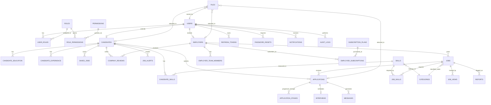

# HireMasr — Database Design & Backend API Specification

> **Project:** HireMasr (Vue 3 Frontend)  
> **Goal:** Replace the static `json-server` backend with a production-ready relational schema, REST API contract, and auth/authorization layer.  
> **Target DB:** PostgreSQL (recommended) or any ANSI-SQL relational engine.  
> **Backend Language Agnostic:** Can be implemented in Laravel, Node.js/Express + Prisma, Django, Spring Boot, etc.

---

## 1. Executive Summary

The current frontend (`db.json` + `json-server`) uses a flat, denormalized document store that causes data integrity issues (e.g., `employer_id` sometimes stores a `user.id`, sometimes an `employer.id`), lacks transactional consistency, has no real auth, and stores passwords in plaintext. This document proposes a **strictly normalized, RBAC-enabled, audit-friendly relational design** with several UX enhancements (job alerts, interview scheduling, moderation, file management, and messaging hooks).

---

## 2. Entity Relationship Diagram (Mermaid)



---

## 3. Table Specifications

### 3.1 Core Identity & Access Management

#### `users`
| Column | Type | Constraints | Notes |
|--------|------|-------------|-------|
| `id` | UUID | PK, default gen_random_uuid() | |
| `email` | VARCHAR(255) | UNIQUE, NOT NULL, indexed | Normalized to lowercase |
| `password_hash` | VARCHAR(255) | NOT NULL | bcrypt / Argon2id |
| `first_name` | VARCHAR(100) | NOT NULL | |
| `last_name` | VARCHAR(100) | NOT NULL | |
| `avatar_url` | VARCHAR(500) | nullable | CDN URL |
| `avatar_file_id` | UUID | FK → files.id, nullable | |
| `phone` | VARCHAR(30) | nullable | E.164 format preferred |
| `is_active` | BOOLEAN | DEFAULT true | Admin can deactivate |
| `email_verified_at` | TIMESTAMPTZ | nullable | |
| `last_login_at` | TIMESTAMPTZ | nullable | |
| `created_at` | TIMESTAMPTZ | DEFAULT now() | |
| `updated_at` | TIMESTAMPTZ | DEFAULT now() | |
| `deleted_at` | TIMESTAMPTZ | nullable | Soft delete |

**Indexes:** `email` (unique), `is_active` + `deleted_at` (composite), `created_at`.

#### `roles`
| Column | Type | Constraints | Notes |
|--------|------|-------------|-------|
| `id` | UUID | PK | |
| `name` | VARCHAR(50) | UNIQUE, NOT NULL | `candidate`, `employer`, `admin`, `moderator` |
| `description` | VARCHAR(255) | nullable | |
| `created_at` | TIMESTAMPTZ | DEFAULT now() | |

#### `user_roles`
| Column | Type | Constraints | Notes |
|--------|------|-------------|-------|
| `user_id` | UUID | PK, FK → users.id | |
| `role_id` | UUID | PK, FK → roles.id | |
| `assigned_at` | TIMESTAMPTZ | DEFAULT now() | |
| `assigned_by` | UUID | FK → users.id, nullable | Audit trail |

#### `permissions`
| Column | Type | Constraints | Notes |
|--------|------|-------------|-------|
| `id` | UUID | PK | |
| `name` | VARCHAR(100) | UNIQUE, NOT NULL | e.g. `jobs:approve` |
| `resource` | VARCHAR(50) | NOT NULL | `jobs`, `users`, `reviews` |
| `action` | VARCHAR(50) | NOT NULL | `create`, `read`, `update`, `delete`, `approve` |
| `created_at` | TIMESTAMPTZ | DEFAULT now() | |

#### `role_permissions`
| Column | Type | Constraints | Notes |
|--------|------|-------------|-------|
| `role_id` | UUID | PK, FK → roles.id | |
| `permission_id` | UUID | PK, FK → permissions.id | |

#### `password_resets`
| Column | Type | Constraints | Notes |
|--------|------|-------------|-------|
| `id` | UUID | PK | |
| `user_id` | UUID | FK → users.id, NOT NULL | |
| `token_hash` | VARCHAR(255) | NOT NULL | SHA-256 of raw token |
| `expires_at` | TIMESTAMPTZ | NOT NULL | 1 hour from creation |
| `used_at` | TIMESTAMPTZ | nullable | |
| `created_at` | TIMESTAMPTZ | DEFAULT now() | |

#### `refresh_tokens`
| Column | Type | Constraints | Notes |
|--------|------|-------------|-------|
| `id` | UUID | PK | |
| `user_id` | UUID | FK → users.id, NOT NULL | |
| `token_hash` | VARCHAR(255) | NOT NULL, indexed | |
| `expires_at` | TIMESTAMPTZ | NOT NULL | 30 days typical |
| `revoked_at` | TIMESTAMPTZ | nullable | |
| `ip_address` | INET | nullable | |
| `user_agent` | VARCHAR(500) | nullable | |
| `created_at` | TIMESTAMPTZ | DEFAULT now() | |

---

### 3.2 Candidate Module

#### `candidates`
| Column | Type | Constraints | Notes |
|--------|------|-------------|-------|
| `id` | UUID | PK | |
| `user_id` | UUID | FK → users.id, UNIQUE, NOT NULL | One-to-one |
| `headline` | VARCHAR(150) | nullable | e.g. "Senior Frontend Developer \| Vue.js" |
| `bio` | TEXT | nullable | Professional summary |
| `location` | VARCHAR(150) | nullable | Human-readable city/area |
| `city` | VARCHAR(100) | nullable | Normalized for filtering |
| `country` | VARCHAR(2) | DEFAULT 'EG' | ISO-3166 alpha-2 |
| `experience_years` | INT | nullable | Total years |
| `education_level` | VARCHAR(20) | nullable | `high_school`, `bachelor`, `master`, `phd`, `diploma` |
| `resume_url` | VARCHAR(500) | nullable | |
| `resume_file_id` | UUID | FK → files.id, nullable | |
| `linkedin_url` | VARCHAR(500) | nullable | |
| `github_url` | VARCHAR(500) | nullable | |
| `portfolio_url` | VARCHAR(500) | nullable | |
| `website_url` | VARCHAR(500) | nullable | |
| `is_open_to_work` | BOOLEAN | DEFAULT true | |
| `preferred_job_type` | VARCHAR(20) | nullable | `full_time`, `part_time`, `contract`, `freelance`, `internship` |
| `preferred_locations` | JSONB | DEFAULT '[]' | Array of city strings |
| `expected_salary_min` | INT | nullable | EGP |
| `expected_salary_max` | INT | nullable | EGP |
| `currency` | VARCHAR(3) | DEFAULT 'EGP' | |
| `profile_completion_score` | SMALLINT | DEFAULT 0, CHECK 0-100 | Computed field |
| `created_at` | TIMESTAMPTZ | DEFAULT now() | |
| `updated_at` | TIMESTAMPTZ | DEFAULT now() | |

**Indexes:** `user_id` (unique), `is_open_to_work`, `city`, `country`, `preferred_job_type`.

#### `candidate_education`
| Column | Type | Constraints | Notes |
|--------|------|-------------|-------|
| `id` | UUID | PK | |
| `candidate_id` | UUID | FK → candidates.id, NOT NULL | |
| `degree` | VARCHAR(150) | NOT NULL | e.g. "Bachelor of Computer Science" |
| `institution` | VARCHAR(200) | NOT NULL | |
| `field_of_study` | VARCHAR(150) | NOT NULL | |
| `start_year` | SMALLINT | NOT NULL | |
| `end_year` | SMALLINT | nullable | NULL if `is_current` |
| `grade` | VARCHAR(50) | nullable | e.g. "Very Good", "GPA 3.5" |
| `is_current` | BOOLEAN | DEFAULT false | |
| `description` | TEXT | nullable | |
| `created_at` | TIMESTAMPTZ | DEFAULT now() | |
| `updated_at` | TIMESTAMPTZ | DEFAULT now() | |

#### `candidate_experience`
| Column | Type | Constraints | Notes |
|--------|------|-------------|-------|
| `id` | UUID | PK | |
| `candidate_id` | UUID | FK → candidates.id, NOT NULL | |
| `title` | VARCHAR(150) | NOT NULL | Job title |
| `company_name` | VARCHAR(150) | NOT NULL | |
| `location` | VARCHAR(150) | nullable | |
| `employment_type` | VARCHAR(20) | NOT NULL | `full_time`, `part_time`, `contract`, `freelance`, `internship` |
| `start_date` | DATE | NOT NULL | |
| `end_date` | DATE | nullable | |
| `is_current` | BOOLEAN | DEFAULT false | |
| `description` | TEXT | nullable | |
| `created_at` | TIMESTAMPTZ | DEFAULT now() | |
| `updated_at` | TIMESTAMPTZ | DEFAULT now() | |

#### `candidate_skills`
| Column | Type | Constraints | Notes |
|--------|------|-------------|-------|
| `id` | UUID | PK | |
| `candidate_id` | UUID | FK → candidates.id, NOT NULL | |
| `skill_id` | UUID | FK → skills.id, NOT NULL | |
| `proficiency_level` | VARCHAR(20) | DEFAULT 'intermediate' | `beginner`, `intermediate`, `advanced`, `expert` |
| `years_experience` | SMALLINT | nullable | |
| `created_at` | TIMESTAMPTZ | DEFAULT now() | |
| `updated_at` | TIMESTAMPTZ | DEFAULT now() | |

**Unique:** (`candidate_id`, `skill_id`)

---

### 3.3 Employer Module

#### `employers`
| Column | Type | Constraints | Notes |
|--------|------|-------------|-------|
| `id` | UUID | PK | |
| `user_id` | UUID | FK → users.id, UNIQUE, NOT NULL | Primary account owner |
| `company_name` | VARCHAR(150) | NOT NULL | |
| `slug` | VARCHAR(150) | UNIQUE, NOT NULL, indexed | SEO-friendly URL |
| `logo_url` | VARCHAR(500) | nullable | |
| `logo_file_id` | UUID | FK → files.id, nullable | |
| `cover_image_url` | VARCHAR(500) | nullable | |
| `cover_image_file_id` | UUID | FK → files.id, nullable | |
| `industry` | VARCHAR(100) | nullable | e.g. "Fintech", "E-commerce" |
| `company_size` | VARCHAR(20) | nullable | `1-10`, `11-50`, `51-200`, `201-500`, `501-1000`, `1001-5000`, `5001-10000`, `10001+` |
| `founded_year` | SMALLINT | nullable | |
| `website` | VARCHAR(255) | nullable | |
| `description` | TEXT | nullable | Company bio |
| `headquarters` | VARCHAR(255) | nullable | |
| `address` | VARCHAR(255) | nullable | |
| `city` | VARCHAR(100) | nullable | |
| `country` | VARCHAR(2) | DEFAULT 'EG' | |
| `is_verified` | BOOLEAN | DEFAULT false | Admin/manual verification |
| `verification_document_id` | UUID | FK → files.id, nullable | Trade license, etc. |
| `average_rating` | DECIMAL(2,1) | DEFAULT 0.0, CHECK 0-5 | Denormalized from reviews |
| `total_reviews` | INT | DEFAULT 0 | Denormalized |
| `created_at` | TIMESTAMPTZ | DEFAULT now() | |
| `updated_at` | TIMESTAMPTZ | DEFAULT now() | |
| `deleted_at` | TIMESTAMPTZ | nullable | Soft delete |

**Indexes:** `slug` (unique), `is_verified`, `industry`, `city`, `country`.

#### `employer_team_members`
| Column | Type | Constraints | Notes |
|--------|------|-------------|-------|
| `id` | UUID | PK | |
| `employer_id` | UUID | FK → employers.id, NOT NULL | |
| `user_id` | UUID | FK → users.id, NOT NULL | Invited team member |
| `role_in_company` | VARCHAR(50) | NOT NULL | e.g. "Recruiter", "HR Manager" |
| `is_primary` | BOOLEAN | DEFAULT false | Owner flag |
| `invited_by` | UUID | FK → users.id | |
| `created_at` | TIMESTAMPTZ | DEFAULT now() | |
| `updated_at` | TIMESTAMPTZ | DEFAULT now() | |

**Unique:** (`employer_id`, `user_id`)

---

### 3.4 Job Taxonomy

#### `categories`
| Column | Type | Constraints | Notes |
|--------|------|-------------|-------|
| `id` | UUID | PK | |
| `name` | VARCHAR(100) | UNIQUE, NOT NULL | e.g. "Software Development" |
| `slug` | VARCHAR(100) | UNIQUE, NOT NULL | |
| `icon` | VARCHAR(50) | nullable | Icon name from design system |
| `description` | TEXT | nullable | |
| `display_order` | SMALLINT | DEFAULT 0 | |
| `is_active` | BOOLEAN | DEFAULT true | |
| `created_at` | TIMESTAMPTZ | DEFAULT now() | |
| `updated_at` | TIMESTAMPTZ | DEFAULT now() | |

#### `skills`
| Column | Type | Constraints | Notes |
|--------|------|-------------|-------|
| `id` | UUID | PK | |
| `name` | VARCHAR(100) | UNIQUE, NOT NULL | e.g. "Vue.js" |
| `slug` | VARCHAR(100) | UNIQUE, NOT NULL | |
| `category_id` | UUID | FK → categories.id, nullable | |
| `is_active` | BOOLEAN | DEFAULT true | |
| `created_at` | TIMESTAMPTZ | DEFAULT now() | |
| `updated_at` | TIMESTAMPTZ | DEFAULT now() | |

**Indexes:** `category_id`, `is_active`.

#### `skill_aliases`
| Column | Type | Constraints | Notes |
|--------|------|-------------|-------|
| `id` | UUID | PK | |
| `skill_id` | UUID | FK → skills.id, NOT NULL | |
| `alias` | VARCHAR(100) | NOT NULL | e.g. "JS" → "JavaScript" |
| `created_at` | TIMESTAMPTZ | DEFAULT now() | |

---

### 3.5 Job Postings

#### `jobs`
| Column | Type | Constraints | Notes |
|--------|------|-------------|-------|
| `id` | UUID | PK | |
| `employer_id` | UUID | FK → employers.id, NOT NULL | **NOT** user.id — normalized |
| `posted_by_user_id` | UUID | FK → users.id, NOT NULL | Team member who clicked "Post" |
| `category_id` | UUID | FK → categories.id, nullable | |
| `title` | VARCHAR(200) | NOT NULL | |
| `slug` | VARCHAR(250) | UNIQUE, NOT NULL, indexed | Auto-generated |
| `description` | TEXT | NOT NULL | Rich text / markdown |
| `requirements` | TEXT | NOT NULL | Bullet list stored as text |
| `responsibilities` | TEXT | nullable | New enhancement |
| `benefits` | TEXT | nullable | |
| `type` | VARCHAR(20) | NOT NULL | `full_time`, `part_time`, `contract`, `freelance`, `internship` |
| `workplace_type` | VARCHAR(20) | NOT NULL | `remote`, `on_site`, `hybrid` |
| `experience_level` | VARCHAR(20) | NOT NULL | `junior`, `mid`, `senior`, `lead`, `executive` |
| `career_level` | VARCHAR(50) | nullable | e.g. "Junior-Mid", "Mid-Senior" |
| `education_level` | VARCHAR(20) | nullable | `high_school`, `bachelor`, `master`, `phd`, `diploma`, `any` |
| `salary_min` | INT | nullable | EGP |
| `salary_max` | INT | nullable | EGP |
| `currency` | VARCHAR(3) | DEFAULT 'EGP' | |
| `is_salary_visible` | BOOLEAN | DEFAULT true | |
| `location` | VARCHAR(200) | NOT NULL | Human-readable |
| `city` | VARCHAR(100) | nullable | Normalized for geo filters |
| `country` | VARCHAR(2) | DEFAULT 'EG' | |
| `vacancies` | SMALLINT | DEFAULT 1, CHECK > 0 | |
| `status` | VARCHAR(20) | DEFAULT 'draft' | `draft`, `pending_review`, `active`, `paused`, `closed`, `rejected`, `expired` |
| `expires_at` | TIMESTAMPTZ | nullable | Auto-close trigger |
| `views_count` | INT | DEFAULT 0 | Denormalized; updated by batch worker |
| `applications_count` | INT | DEFAULT 0 | Denormalized; updated by trigger |
| `is_featured` | BOOLEAN | DEFAULT false | |
| `featured_until` | TIMESTAMPTZ | nullable | |
| `created_at` | TIMESTAMPTZ | DEFAULT now() | |
| `updated_at` | TIMESTAMPTZ | DEFAULT now() | |
| `deleted_at` | TIMESTAMPTZ | nullable | Soft delete |
| `rejection_reason` | TEXT | nullable | If admin rejects |

**Indexes:**
- `slug` (unique)
- `employer_id` + `status` (composite)
- `category_id` + `status` (composite)
- `status` + `is_featured` + `created_at` (composite, for public listings)
- `city` + `country` + `status` (composite, for geo search)
- Full-text search index on (`title`, `description`, `requirements`) using GIN (PostgreSQL) or equivalent.

#### `job_skills`
| Column | Type | Constraints | Notes |
|--------|------|-------------|-------|
| `id` | UUID | PK | |
| `job_id` | UUID | FK → jobs.id, NOT NULL | |
| `skill_id` | UUID | FK → skills.id, NOT NULL | |
| `is_required` | BOOLEAN | DEFAULT true | `false` = nice-to-have |
| `min_proficiency` | VARCHAR(20) | nullable | `beginner`, `intermediate`, `advanced`, `expert` |
| `created_at` | TIMESTAMPTZ | DEFAULT now() | |

**Unique:** (`job_id`, `skill_id`)

---

### 3.6 Applications & Hiring Pipeline

#### `applications`
| Column | Type | Constraints | Notes |
|--------|------|-------------|-------|
| `id` | UUID | PK | |
| `job_id` | UUID | FK → jobs.id, NOT NULL | |
| `candidate_id` | UUID | FK → candidates.id, NOT NULL | |
| `cover_letter` | TEXT | nullable | |
| `candidate_snapshot` | JSONB | NOT NULL | Immutable snapshot at time of application |
| `status` | VARCHAR(20) | DEFAULT 'applied' | `applied`, `reviewed`, `shortlisted`, `interviewed`, `offered`, `hired`, `rejected`, `withdrawn` |
| `current_stage` | VARCHAR(50) | nullable | Human-readable stage label |
| `withdrawn_at` | TIMESTAMPTZ | nullable | |
| `withdrawn_reason` | VARCHAR(255) | nullable | |
| `applied_at` | TIMESTAMPTZ | DEFAULT now() | |
| `updated_at` | TIMESTAMPTZ | DEFAULT now() | |

**Indexes:** `job_id` + `status`, `candidate_id` + `applied_at`.
**Unique:** (`job_id`, `candidate_id`) — prevent duplicate applications.

> **Candidate Snapshot JSONB Schema:**
> ```json
> {
>   "name": "Ahmed Khaled",
>   "email": "ahmed@example.com",
>   "headline": "Senior Frontend Developer",
>   "location": "Cairo, Egypt",
>   "bio": "...",
>   "skills": ["Vue.js", "React"],
>   "experience_summary": "5 years...",
>   "education_summary": "B.Sc. CS, Cairo University",
>   "linkedin_url": "...",
>   "github_url": "...",
>   "portfolio_url": "...",
>   "expected_salary_min": 25000,
>   "expected_salary_max": 40000,
>   "resume_url": "..."
> }
> ```

#### `application_stages`
| Column | Type | Constraints | Notes |
|--------|------|-------------|-------|
| `id` | UUID | PK | |
| `application_id` | UUID | FK → applications.id, NOT NULL | |
| `stage` | VARCHAR(20) | NOT NULL | Same enum as `applications.status` |
| `notes` | TEXT | nullable | Internal recruiter notes |
| `changed_by_user_id` | UUID | FK → users.id, nullable | |
| `created_at` | TIMESTAMPTZ | DEFAULT now() | |

**Index:** `application_id` + `created_at`.

#### `interviews` *(Enhancement)*
| Column | Type | Constraints | Notes |
|--------|------|-------------|-------|
| `id` | UUID | PK | |
| `application_id` | UUID | FK → applications.id, NOT NULL | |
| `scheduled_at` | TIMESTAMPTZ | NOT NULL | |
| `duration_minutes` | SMALLINT | DEFAULT 60 | |
| `location_type` | VARCHAR(20) | NOT NULL | `video_call`, `phone`, `in_person` |
| `location_details` | VARCHAR(255) | nullable | Zoom link, address, etc. |
| `notes` | TEXT | nullable | Agenda / prep notes |
| `status` | VARCHAR(20) | DEFAULT 'scheduled' | `scheduled`, `completed`, `cancelled`, `no_show` |
| `created_by_user_id` | UUID | FK → users.id, NOT NULL | |
| `created_at` | TIMESTAMPTZ | DEFAULT now() | |
| `updated_at` | TIMESTAMPTZ | DEFAULT now() | |

---

### 3.7 Candidate Engagement

#### `saved_jobs`
| Column | Type | Constraints | Notes |
|--------|------|-------------|-------|
| `id` | UUID | PK | |
| `candidate_id` | UUID | FK → candidates.id, NOT NULL | |
| `job_id` | UUID | FK → jobs.id, NOT NULL | |
| `notes` | TEXT | nullable | Personal note |
| `saved_at` | TIMESTAMPTZ | DEFAULT now() | |

**Unique:** (`candidate_id`, `job_id`)

#### `job_alerts` *(Enhancement)*
| Column | Type | Constraints | Notes |
|--------|------|-------------|-------|
| `id` | UUID | PK | |
| `candidate_id` | UUID | FK → candidates.id, NOT NULL | |
| `name` | VARCHAR(100) | nullable | e.g. "Remote Vue Jobs" |
| `keywords` | VARCHAR(200) | nullable | Search terms |
| `category_id` | UUID | FK → categories.id, nullable | |
| `job_type` | VARCHAR(20) | nullable | |
| `workplace_type` | VARCHAR(20) | nullable | |
| `experience_level` | VARCHAR(20) | nullable | |
| `location` | VARCHAR(100) | nullable | |
| `salary_min` | INT | nullable | |
| `frequency` | VARCHAR(20) | DEFAULT 'weekly' | `daily`, `weekly`, `instant` |
| `is_active` | BOOLEAN | DEFAULT true | |
| `last_sent_at` | TIMESTAMPTZ | nullable | |
| `created_at` | TIMESTAMPTZ | DEFAULT now() | |
| `updated_at` | TIMESTAMPTZ | DEFAULT now() | |

---

### 3.8 Reviews & Reputation

#### `company_reviews`
| Column | Type | Constraints | Notes |
|--------|------|-------------|-------|
| `id` | UUID | PK | |
| `employer_id` | UUID | FK → employers.id, NOT NULL | |
| `candidate_id` | UUID | FK → candidates.id, NOT NULL | |
| `job_title_at_time` | VARCHAR(150) | nullable | |
| `employment_type` | VARCHAR(20) | nullable | |
| `is_current_employee` | BOOLEAN | DEFAULT false | |
| `is_anonymous` | BOOLEAN | DEFAULT false | |
| `rating_overall` | SMALLINT | NOT NULL, CHECK 1-5 | |
| `rating_work_life_balance` | SMALLINT | nullable, CHECK 1-5 | |
| `rating_salary` | SMALLINT | nullable, CHECK 1-5 | |
| `rating_culture` | SMALLINT | nullable, CHECK 1-5 | |
| `rating_management` | SMALLINT | nullable, CHECK 1-5 | |
| `rating_career_growth` | SMALLINT | nullable, CHECK 1-5 | |
| `title` | VARCHAR(200) | NOT NULL | Review headline |
| `pros` | TEXT | nullable | |
| `cons` | TEXT | nullable | |
| `advice` | TEXT | nullable | To management |
| `is_approved` | BOOLEAN | DEFAULT false | Moderation queue |
| `approved_by` | UUID | FK → users.id, nullable | |
| `approved_at` | TIMESTAMPTZ | nullable | |
| `created_at` | TIMESTAMPTZ | DEFAULT now() | |
| `updated_at` | TIMESTAMPTZ | DEFAULT now() | |

**Index:** `employer_id` + `is_approved` + `created_at`.
**Unique:** (`employer_id`, `candidate_id`) — one review per candidate per employer.

---

### 3.9 Notifications & Messaging *(Enhancements)*

#### `notifications`
| Column | Type | Constraints | Notes |
|--------|------|-------------|-------|
| `id` | UUID | PK | |
| `user_id` | UUID | FK → users.id, NOT NULL | |
| `type` | VARCHAR(50) | NOT NULL | `application_status_changed`, `new_application`, `interview_scheduled`, `saved_job_expiring`, `job_flagged`, `system_announcement` |
| `title` | VARCHAR(200) | NOT NULL | |
| `message` | TEXT | NOT NULL | |
| `data` | JSONB | nullable | Polymorphic payload (ids, urls) |
| `action_url` | VARCHAR(500) | nullable | Deep link |
| `is_read` | BOOLEAN | DEFAULT false | |
| `read_at` | TIMESTAMPTZ | nullable | |
| `created_at` | TIMESTAMPTZ | DEFAULT now() | |

**Index:** `user_id` + `is_read` + `created_at`.

#### `conversations` *(Future Enhancement — messaging)*
| Column | Type | Constraints | Notes |
|--------|------|-------------|-------|
| `id` | UUID | PK | |
| `application_id` | UUID | FK → applications.id, nullable | Optional thread tied to application |
| `subject` | VARCHAR(200) | nullable | |
| `created_at` | TIMESTAMPTZ | DEFAULT now() | |
| `updated_at` | TIMESTAMPTZ | DEFAULT now() | |

#### `conversation_participants`
| Column | Type | Constraints | Notes |
|--------|------|-------------|-------|
| `conversation_id` | UUID | PK, FK | |
| `user_id` | UUID | PK, FK | |
| `joined_at` | TIMESTAMPTZ | DEFAULT now() | |
| `last_read_at` | TIMESTAMPTZ | nullable | |

#### `messages`
| Column | Type | Constraints | Notes |
|--------|------|-------------|-------|
| `id` | UUID | PK | |
| `conversation_id` | UUID | FK → conversations.id, NOT NULL | |
| `sender_id` | UUID | FK → users.id, NOT NULL | |
| `content` | TEXT | NOT NULL | |
| `attachment_file_id` | UUID | FK → files.id, nullable | |
| `is_edited` | BOOLEAN | DEFAULT false | |
| `edited_at` | TIMESTAMPTZ | nullable | |
| `created_at` | TIMESTAMPTZ | DEFAULT now() | |

---

### 3.10 Moderation & Reporting *(Enhancements)*

#### `reports`
| Column | Type | Constraints | Notes |
|--------|------|-------------|-------|
| `id` | UUID | PK | |
| `reporter_id` | UUID | FK → users.id, NOT NULL | |
| `type` | VARCHAR(20) | NOT NULL | `job`, `review`, `user`, `employer`, `message` |
| `target_type` | VARCHAR(50) | NOT NULL | Polymorphic type name |
| `target_id` | UUID | NOT NULL | Polymorphic ID |
| `reason` | VARCHAR(50) | NOT NULL | `spam`, `fraudulent`, `misleading`, `inappropriate`, `discriminatory`, `other` |
| `details` | TEXT | nullable | |
| `status` | VARCHAR(20) | DEFAULT 'pending' | `pending`, `investigating`, `resolved`, `dismissed` |
| `resolved_by_user_id` | UUID | FK → users.id, nullable | |
| `resolution_notes` | TEXT | nullable | |
| `created_at` | TIMESTAMPTZ | DEFAULT now() | |
| `updated_at` | TIMESTAMPTZ | DEFAULT now() | |

---

### 3.11 Analytics & Audit *(Enhancements)*

#### `job_views`
| Column | Type | Constraints | Notes |
|--------|------|-------------|-------|
| `id` | BIGSERIAL / BIGINT | PK | High volume table |
| `job_id` | UUID | FK → jobs.id, NOT NULL | |
| `ip_address` | INET | nullable | |
| `user_id` | UUID | FK → users.id, nullable | Anonymous views allowed |
| `user_agent` | VARCHAR(500) | nullable | |
| `referrer` | VARCHAR(500) | nullable | |
| `session_id` | VARCHAR(100) | nullable | Deduplication key |
| `created_at` | TIMESTAMPTZ | DEFAULT now() | |

**Partitioning Strategy:** Range partition on `created_at` by month (PostgreSQL).  
**Index:** `job_id` + `created_at`, `session_id` (for dedup).

#### `audit_logs`
| Column | Type | Constraints | Notes |
|--------|------|-------------|-------|
| `id` | BIGSERIAL / BIGINT | PK | |
| `user_id` | UUID | FK → users.id, nullable | System actions = NULL |
| `action` | VARCHAR(50) | NOT NULL | `created`, `updated`, `deleted`, `approved`, `rejected`, `activated`, `deactivated` |
| `entity_type` | VARCHAR(50) | NOT NULL | `job`, `user`, `application`, `review` |
| `entity_id` | UUID | nullable | |
| `old_values` | JSONB | nullable | Before state |
| `new_values` | JSONB | nullable | After state |
| `ip_address` | INET | nullable | |
| `user_agent` | VARCHAR(500) | nullable | |
| `created_at` | TIMESTAMPTZ | DEFAULT now() | |

---

### 3.12 File Management *(Enhancement)*

#### `files`
| Column | Type | Constraints | Notes |
|--------|------|-------------|-------|
| `id` | UUID | PK | |
| `owner_id` | UUID | FK → users.id, NOT NULL | Uploader |
| `file_name` | VARCHAR(255) | NOT NULL | Stored filename (UUID.ext) |
| `original_name` | VARCHAR(255) | NOT NULL | User-facing name |
| `mime_type` | VARCHAR(100) | NOT NULL | |
| `size_bytes` | BIGINT | NOT NULL | |
| `storage_path` | VARCHAR(500) | NOT NULL | S3 / MinIO / local path |
| `url` | VARCHAR(500) | NOT NULL | Public or signed URL |
| `file_type` | VARCHAR(20) | NOT NULL | `resume`, `avatar`, `company_logo`, `company_cover`, `document`, `attachment` |
| `entity_type` | VARCHAR(50) | nullable | Polymorphic: `candidate`, `employer`, `application` |
| `entity_id` | UUID | nullable | |
| `created_at` | TIMESTAMPTZ | DEFAULT now() | |
| `updated_at` | TIMESTAMPTZ | DEFAULT now() | |
| `deleted_at` | TIMESTAMPTZ | nullable | Soft delete for orphaned file cleanup |

---

### 3.13 Billing *(Enhancement — Future Monetization)*

#### `subscription_plans`
| Column | Type | Constraints | Notes |
|--------|------|-------------|-------|
| `id` | UUID | PK | |
| `name` | VARCHAR(100) | NOT NULL | e.g. "Starter", "Growth", "Enterprise" |
| `slug` | VARCHAR(100) | UNIQUE, NOT NULL | |
| `description` | TEXT | nullable | |
| `price_monthly` | DECIMAL(10,2) | NOT NULL | EGP |
| `price_annually` | DECIMAL(10,2) | NOT NULL | EGP |
| `currency` | VARCHAR(3) | DEFAULT 'EGP' | |
| `max_active_jobs` | INT | NOT NULL | |
| `max_featured_jobs` | INT | DEFAULT 0 | |
| `has_analytics` | BOOLEAN | DEFAULT false | |
| `has_priority_support` | BOOLEAN | DEFAULT false | |
| `is_active` | BOOLEAN | DEFAULT true | |
| `created_at` | TIMESTAMPTZ | DEFAULT now() | |
| `updated_at` | TIMESTAMPTZ | DEFAULT now() | |

#### `employer_subscriptions`
| Column | Type | Constraints | Notes |
|--------|------|-------------|-------|
| `id` | UUID | PK | |
| `employer_id` | UUID | FK → employers.id, NOT NULL | |
| `plan_id` | UUID | FK → subscription_plans.id, NOT NULL | |
| `status` | VARCHAR(20) | DEFAULT 'trial' | `trial`, `active`, `cancelled`, `expired`, `past_due` |
| `started_at` | TIMESTAMPTZ | NOT NULL | |
| `expires_at` | TIMESTAMPTZ | NOT NULL | |
| `cancelled_at` | TIMESTAMPTZ | nullable | |
| `payment_method` | VARCHAR(50) | nullable | `fawry`, `vodafone_cash`, `card` |
| `created_at` | TIMESTAMPTZ | DEFAULT now() | |
| `updated_at` | TIMESTAMPTZ | DEFAULT now() | |

---

## 4. REST API Contract

### 4.1 Authentication Endpoints

| Method | Endpoint | Auth | Description |
|--------|----------|------|-------------|
| `POST` | `/api/v1/auth/register` | Public | Register candidate or employer |
| `POST` | `/api/v1/auth/login` | Public | Email + password → tokens |
| `POST` | `/api/v1/auth/refresh` | Public (refresh token) | Rotate access token |
| `POST` | `/api/v1/auth/logout` | Bearer | Revoke refresh token |
| `POST` | `/api/v1/auth/logout-all` | Bearer | Revoke all user sessions |
| `POST` | `/api/v1/auth/forgot-password` | Public | Send reset email |
| `POST` | `/api/v1/auth/reset-password` | Public | Consume reset token |
| `POST` | `/api/v1/auth/verify-email` | Public | Consume verification token |
| `POST` | `/api/v1/auth/resend-verification` | Bearer | Resend email verification |
| `GET` | `/api/v1/auth/me` | Bearer | Current user + role + profile |
| `PATCH` | `/api/v1/auth/me` | Bearer | Update own name, phone, avatar |

#### Register Request Body
```json
{
  "first_name": "Ahmed",
  "last_name": "Khaled",
  "email": "ahmed@example.com",
  "password": "SecurePass123!",
  "role": "candidate",
  "company_name": "Acme Inc"       // required only if role == employer
}
```

#### Login Response
```json
{
  "access_token": "eyJhbGciOiJSUzI1NiIs...",
  "token_type": "Bearer",
  "expires_in": 900,
  "refresh_token": "def50200...",
  "user": {
    "id": "uuid",
    "email": "ahmed@example.com",
    "first_name": "Ahmed",
    "last_name": "Khaled",
    "avatar_url": "...",
    "roles": ["candidate"],
    "permissions": [],
    "profile": { /* candidate or employer profile */ }
  }
}
```

---

### 4.2 Public / Unauthenticated Endpoints

| Method | Endpoint | Description |
|--------|----------|-------------|
| `GET` | `/api/v1/jobs` | List active jobs (paginated, filterable) |
| `GET` | `/api/v1/jobs/:slug` | Job detail (increments view asynchronously) |
| `GET` | `/api/v1/categories` | Active categories with job counts |
| `GET` | `/api/v1/skills` | Skill autocomplete |
| `GET` | `/api/v1/employers` | Verified employers list |
| `GET` | `/api/v1/employers/:slug` | Employer public profile + active jobs + approved reviews |
| `GET` | `/api/v1/employers/:slug/reviews` | Paginated approved reviews |

#### Job List Query Parameters
```
GET /api/v1/jobs?category=software-development
              &type=full_time
              &workplace=remote
              &experience=senior
              &location=Cairo
              &salary_min=20000&salary_max=50000
              &search=vue+frontend
              &skills=1,2,5
              &page=1&per_page=20
              &sort=created_at:desc
```

---

### 4.3 Candidate Endpoints

All require `Bearer` token + `candidate` role.

| Method | Endpoint | Description |
|--------|----------|-------------|
| `GET` | `/api/v1/candidate/profile` | Full profile + education + experience + skills |
| `PUT` | `/api/v1/candidate/profile` | Upsert candidate profile (bio, headline, socials, preferences) |
| `POST` | `/api/v1/candidate/education` | Add education entry |
| `PUT` | `/api/v1/candidate/education/:id` | Update entry |
| `DELETE` | `/api/v1/candidate/education/:id` | Remove entry |
| `POST` | `/api/v1/candidate/experience` | Add work experience |
| `PUT` | `/api/v1/candidate/experience/:id` | Update entry |
| `DELETE` | `/api/v1/candidate/experience/:id` | Remove entry |
| `POST` | `/api/v1/candidate/skills` | Batch sync candidate skills (replaces entire set) |
| `GET` | `/api/v1/candidate/applications` | My applications with job summary |
| `POST` | `/api/v1/candidate/applications` | Apply to a job (cover_letter) |
| `PATCH` | `/api/v1/candidate/applications/:id/withdraw` | Withdraw application |
| `GET` | `/api/v1/candidate/saved-jobs` | Bookmarked jobs |
| `POST` | `/api/v1/candidate/saved-jobs` | Save a job |
| `DELETE` | `/api/v1/candidate/saved-jobs/:job_id` | Unsave |
| `GET` | `/api/v1/candidate/notifications` | My notifications (paginated) |
| `PATCH` | `/api/v1/candidate/notifications/:id/read` | Mark as read |
| `PATCH` | `/api/v1/candidate/notifications/read-all` | Bulk read |
| `GET` | `/api/v1/candidate/job-alerts` | List alerts |
| `POST` | `/api/v1/candidate/job-alerts` | Create alert |
| `DELETE` | `/api/v1/candidate/job-alerts/:id` | Delete alert |

#### Batch Sync Skills Request
```json
{
  "skills": [
    { "skill_id": "uuid", "proficiency_level": "expert", "years_experience": 5 },
    { "name": "Nuxt.js", "proficiency_level": "advanced" }  // auto-create skill if missing
  ]
}
```

---

### 4.4 Employer Endpoints

Require `Bearer` token + `employer` role (or team member via `employer_team_members`).

| Method | Endpoint | Description |
|--------|----------|-------------|
| `GET` | `/api/v1/employer/profile` | Company profile + team members |
| `PUT` | `/api/v1/employer/profile` | Update company details |
| `GET` | `/api/v1/employer/jobs` | All jobs posted by this employer |
| `POST` | `/api/v1/employer/jobs` | Create job (status = `pending_review` by default) |
| `GET` | `/api/v1/employer/jobs/:id` | Job detail with applicant stats |
| `PUT` | `/api/v1/employer/jobs/:id` | Edit job (if not closed) |
| `PATCH` | `/api/v1/employer/jobs/:id/status` | Toggle `active` ↔ `closed` or `paused` |
| `DELETE` | `/api/v1/employer/jobs/:id` | Soft delete (admin only hard delete) |
| `GET` | `/api/v1/employer/applications` | All applications across employer jobs |
| `GET` | `/api/v1/employer/applications/:id` | Full application + candidate profile + education + experience |
| `PATCH` | `/api/v1/employer/applications/:id/status` | Move to next stage (`reviewed`, `shortlisted`, `interviewed`, `offered`, `rejected`) |
| `POST` | `/api/v1/employer/applications/:id/interviews` | Schedule interview |
| `PUT` | `/api/v1/employer/applications/:id/interviews/:interview_id` | Reschedule / update |
| `GET` | `/api/v1/employer/analytics` | Job views, application conversion rates, top sources |
| `GET` | `/api/v1/employer/reviews` | Reviews about this company (with moderation status) |
| `POST` | `/api/v1/employer/reviews/:id/reply` | Official employer reply to a review |

---

### 4.5 Admin Endpoints

Require `Bearer` token + `admin` role + relevant permission.

| Method | Endpoint | Permission | Description |
|--------|----------|------------|-------------|
| `GET` | `/api/v1/admin/dashboard` | `read:dashboard` | Stats cards, charts |
| `GET` | `/api/v1/admin/users` | `read:users` | List all users (paginated, filterable) |
| `GET` | `/api/v1/admin/users/:id` | `read:users` | User detail + role-specific activity |
| `PATCH` | `/api/v1/admin/users/:id/status` | `update:users` | Activate / deactivate |
| `PATCH` | `/api/v1/admin/users/:id/role` | `update:users` | Assign / revoke roles |
| `GET` | `/api/v1/admin/jobs` | `read:jobs` | All jobs with moderation queue |
| `GET` | `/api/v1/admin/jobs/:id` | `read:jobs` | Job detail + application list |
| `PATCH` | `/api/v1/admin/jobs/:id/status` | `update:jobs` | Approve, reject, close, re-activate |
| `DELETE` | `/api/v1/admin/jobs/:id` | `delete:jobs` | Hard delete (with cascade) |
| `POST` | `/api/v1/admin/jobs` | `create:jobs` | Post on behalf of employer |
| `GET` | `/api/v1/admin/reviews` | `read:reviews` | Pending review moderation queue |
| `PATCH` | `/api/v1/admin/reviews/:id/approve` | `update:reviews` | Approve / reject review |
| `GET` | `/api/v1/admin/reports` | `read:reports` | All reports |
| `PATCH` | `/api/v1/admin/reports/:id` | `update:reports` | Update investigation status |
| `GET` | `/api/v1/admin/audit-logs` | `read:audit_logs` | Filterable audit trail |
| `GET` | `/api/v1/admin/categories` | `read:categories` | List categories |
| `POST` | `/api/v1/admin/categories` | `create:categories` | Create category |
| `PUT` | `/api/v1/admin/categories/:id` | `update:categories` | Update category |
| `GET` | `/api/v1/admin/skills` | `read:skills` | Skill management |
| `POST` | `/api/v1/admin/skills` | `create:skills` | Add skill |
| `PUT` | `/api/v1/admin/skills/:id` | `update:skills` | Merge / rename skill |
| `GET` | `/api/v1/admin/subscription-plans` | `read:plans` | Billing plans |
| `POST` | `/api/v1/admin/subscription-plans` | `create:plans` | Create plan |
| `PUT` | `/api/v1/admin/subscription-plans/:id` | `update:plans` | Edit plan |

---

## 5. Authorization & Role-Based Access Control (RBAC)

### 5.1 Role Hierarchy

| Role | Typical Permissions |
|------|---------------------|
| `candidate` | `read:own_profile`, `write:own_profile`, `read:jobs`, `write:applications`, `read:own_applications`, `write:saved_jobs`, `write:reviews` |
| `employer` | `read:own_employer`, `write:own_employer`, `read:own_jobs`, `write:own_jobs`, `read:own_applications`, `write:own_applications`, `read:own_reviews`, `write:review_replies` |
| `admin` | `manage:users`, `manage:jobs`, `manage:reviews`, `manage:categories`, `manage:skills`, `read:dashboard`, `read:audit_logs`, `manage:reports` |
| `moderator` *(future)* | `read:jobs`, `update:jobs`, `read:reviews`, `update:reviews`, `read:reports`, `update:reports` |

### 5.2 Middleware Stack (Conceptual)

1. **Authenticate** — Verify JWT access token (RS256 recommended; store public key in API Gateway).
2. **AuthorizeRole** — Check `user.roles` contains required role.
3. **AuthorizePermission** — Check `user.permissions[]` contains required permission string.
4. **ResourceOwnership** — For employer routes, verify `job.employer_id` matches `req.user.employer_id` (or team membership via `employer_team_members`).
5. **AuditLog** — Fire-and-forget write to `audit_logs` for `DELETE`, `PATCH status`, `POST` on sensitive resources.

---

## 6. Critical Data Integrity Fixes vs. Current JSON Server

| Current Problem | Proposed Fix |
|-----------------|--------------|
| `employer_id` in `jobs` stores `user.id` instead of `employer.id` | Foreign key `jobs.employer_id → employers.id`. Posted-by user stored separately in `posted_by_user_id`. |
| Plaintext passwords (`123456`) | `password_hash` with bcrypt cost 12+ or Argon2id. |
| No email verification | `email_verified_at` + verification token workflow. |
| No session management | `refresh_tokens` table with revocation, expiry, device tracking. |
| `candidate_id` in applications sometimes stores `user.id`, sometimes `candidate.id` | Strict FK to `candidates.id`. Snapshot JSONB preserves human-readable data. |
| `applications.status` is just a string with no history | `application_stages` table provides full audit trail. |
| `users.role` is a single string | `roles` + `user_roles` join table allows multiple roles (e.g., candidate → employer migration). |
| No file management | `files` table with polymorphic attachment (`entity_type` + `entity_id`). |
| Skills stored as string array on candidate | Normalized `candidate_skills` join table with proficiency. |
| `job.technologies` string array | Normalized `job_skills` join table with `is_required` flag. |
| No search indexing | GIN / full-text index on `jobs.title`, `description`, `requirements`. |
| Counter columns (`views`, `applications_count`) updated inline | Denormalized counters updated by background worker or trigger; raw events in `job_views`. |
| No audit trail | `audit_logs` captures before/after JSON for every state change. |

---

## 7. Backend Implementation Recommendations

### 7.1 Preferred Stack Options

| Layer | Recommendation |
|-------|----------------|
| **Runtime** | Node.js 20+ (Express / NestJS) or PHP 8.3 (Laravel 11) or Python (Django / FastAPI) |
| **ORM** | Prisma (Node), Eloquent (Laravel), or SQLAlchemy (Python) |
| **Database** | PostgreSQL 15+ (for JSONB, full-text search, row-level security) |
| **Cache** | Redis (sessions, rate limiting, job queues, featured jobs cache) |
| **Queue** | Redis + BullMQ (Node) or Laravel Queues / Celery (Python) |
| **Search** | PostgreSQL `tsvector` for MVP; migrate to Elasticsearch/OpenSearch if > 100k jobs |
| **Storage** | AWS S3 or MinIO (self-hosted) for resumes, avatars, logos |
| **Email** | AWS SES, Mailgun, or Resend for transactional emails |
| **Auth** | Stateless JWT (access) + Redis-backed refresh tokens; avoid sessions for horizontal scaling |

### 7.2 Key Database Triggers / Business Rules

1. **Auto-Close Expired Jobs** — Cron or pg_cron: `UPDATE jobs SET status='expired' WHERE expires_at < NOW() AND status = 'active'`.
2. **Application Counter Trigger** — After insert/delete on `applications`, recalc `jobs.applications_count` for that job.
3. **Review Aggregate Trigger** — After insert/update on `company_reviews` (where `is_approved=true`), recalc `employers.average_rating` and `employers.total_reviews`.
4. **Profile Completion Score** — Computed nightly or on-demand based on filled fields, education count, experience count, skills count.
5. **Slug Uniqueness** — If collision on `jobs.slug` or `employers.slug`, append `-2`, `-3`, etc.
6. **Email Normalization** — Always store lowercase; enforce uniqueness with `citext` (PostgreSQL) or functional index.

### 7.3 API Rate Limiting Suggestions

| Endpoint Group | Limit |
|----------------|-------|
| Auth (login, register, forgot password) | 5 requests / minute / IP |
| Job applications | 20 applications / day / candidate |
| Job postings | Based on subscription plan |
| Public job search | 100 requests / minute / IP |
| Admin endpoints | 500 requests / minute / user |

---

## 8. Entity-Attribute Summary (Quick Reference)

| Entity | Count Est. | Core Purpose |
|--------|-----------|--------------|
| `users` | 1 per person | Identity, auth, soft-delete |
| `roles`, `user_roles`, `permissions` | 4-8 roles | RBAC backbone |
| `candidates` | 1 per candidate | Profile, preferences, socials |
| `candidate_education` | 1-5 per candidate | Academic history |
| `candidate_experience` | 2-8 per candidate | Work history |
| `candidate_skills` | 5-20 per candidate | Skill inventory |
| `employers` | 1 per company | Company profile, verification |
| `employer_team_members` | 1-10 per company | Multi-user company accounts |
| `categories` | ~20 | Job taxonomy |
| `skills` | ~500-2000 | Skill taxonomy with aliases |
| `jobs` | 100-10k+ | Job postings with full-text search |
| `job_skills` | 3-10 per job | Required/nice-to-have skills |
| `applications` | 10-100 per job | Candidate applications |
| `application_stages` | 1-8 per application | Hiring pipeline history |
| `interviews` | 0-3 per application | Scheduled meetings |
| `saved_jobs` | 0-50 per candidate | Bookmarks |
| `job_alerts` | 0-5 per candidate | Email alert subscriptions |
| `company_reviews` | 5-200 per employer | Employee reviews |
| `notifications` | 100-1000 per user | In-app notification inbox |
| `messages`, `conversations` | 0-50 per application | Chat (future) |
| `reports` | Low volume | Moderation queue |
| `job_views` | Very high | Time-series analytics; partition monthly |
| `audit_logs` | High | Admin accountability; retain 1-2 years |
| `files` | Medium | Resumes, avatars, logos |
| `subscription_plans`, `employer_subscriptions` | Low | Monetization layer |

---

*Document Version: 1.0*  
*Generated for: HireMasr Project*  
*Next Steps: Implement backend API using this spec, then update frontend `api.js` service layer to consume real endpoints.*
